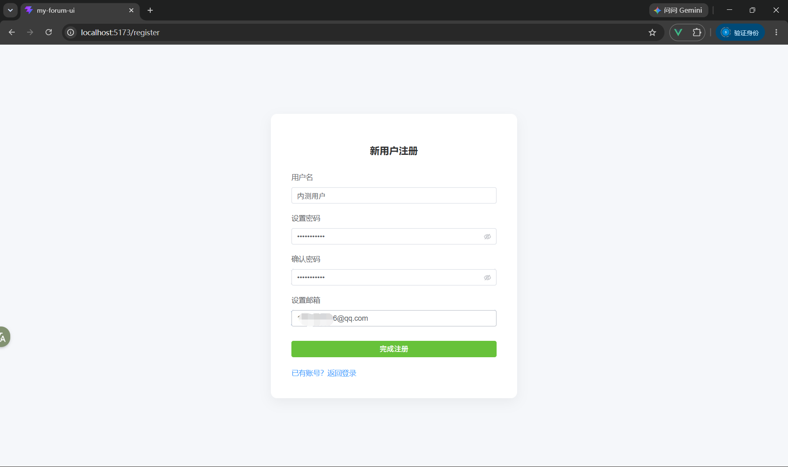
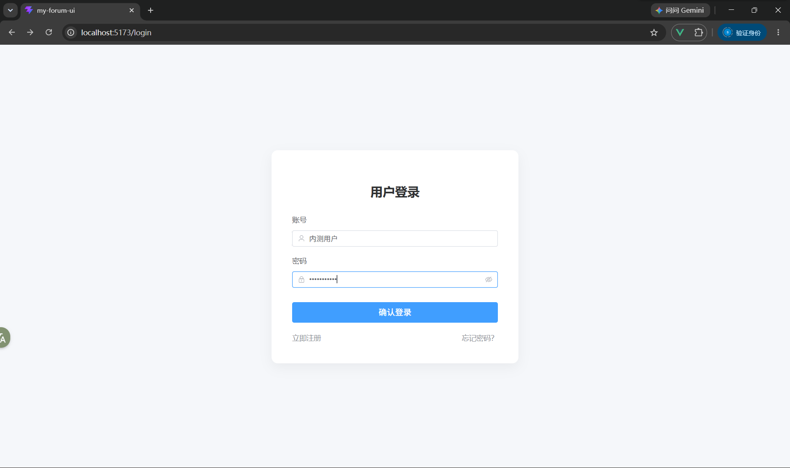
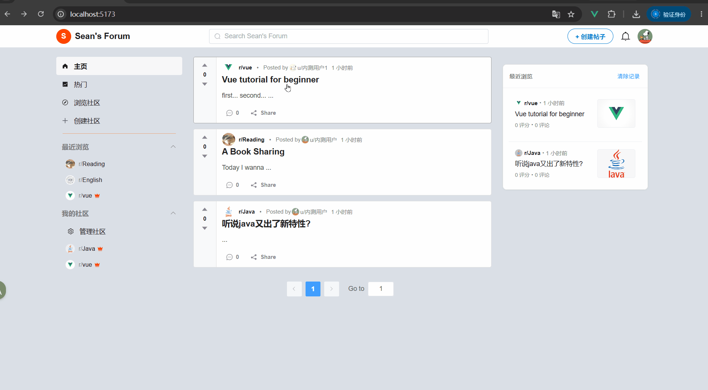
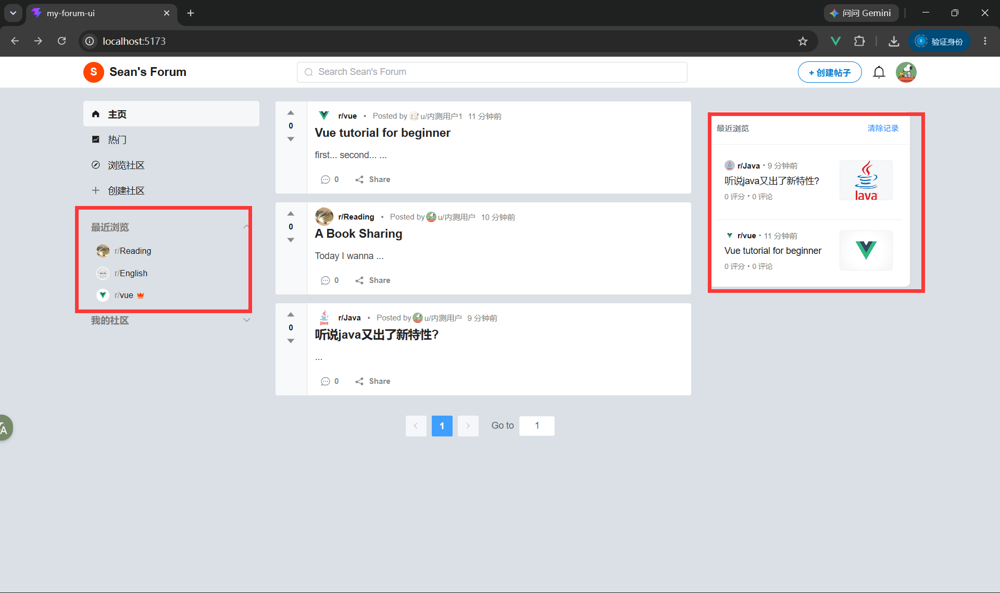
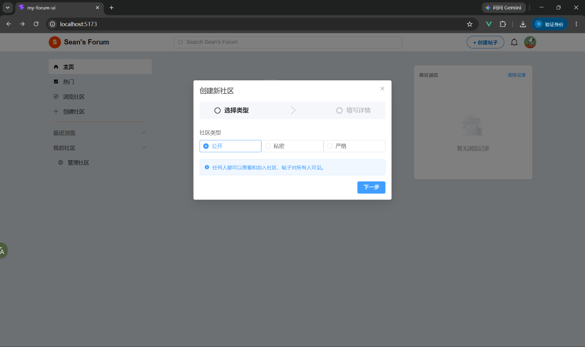
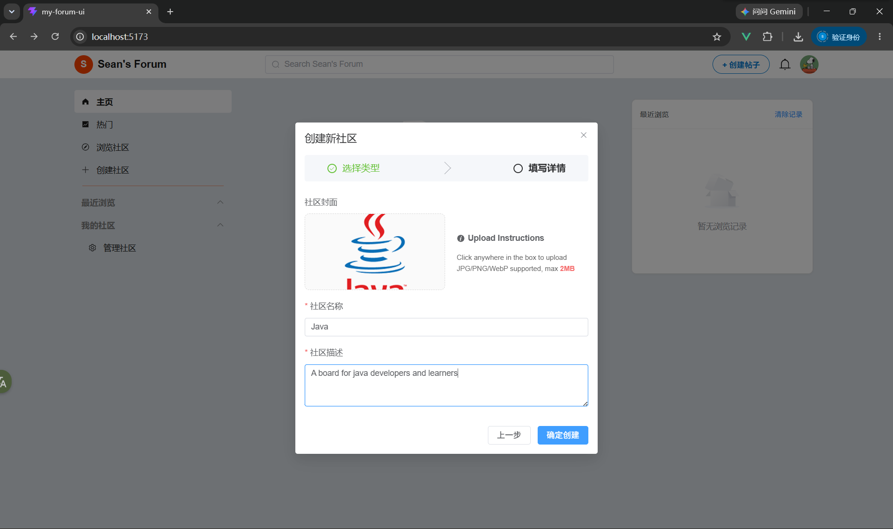
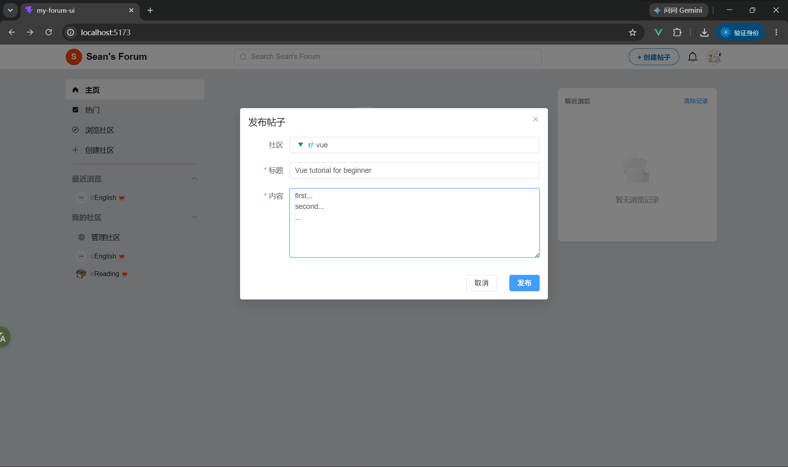
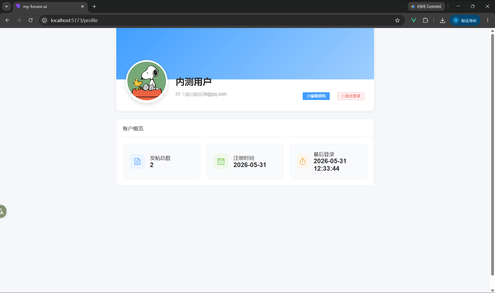

# Sean's Forum

一个基于 Spring Boot 3 与 Vue 3 的前后端分离社区论坛系统，围绕用户认证、社区板块、内容发布、评论互动、评分、站内消息和最近浏览记录构建完整业务闭环。

该项目是个人学习与求职展示项目，当前采用单体架构，重点实践 RESTful API 设计、MySQL 数据建模、Redis 缓存、事件解耦、前后端联调和接口性能测试，不以大规模生产部署或复杂分布式架构为目标。

## 项目亮点

- 使用 JWT、登录拦截器和 `ThreadLocal` 管理请求级用户上下文，使用 BCrypt 保存密码哈希。
- 覆盖用户、社区、帖子、评论/子评论、点赞/点踩、消息通知和浏览记录等主要论坛场景。
- 使用 Spring Event 与异步线程池解耦部分计数更新、消息发送和浏览记录逻辑。
- 使用 Redis 保存邮箱验证码、近期浏览记录和未读消息数等状态数据。
- 对 `/posts` 的四种排序开展 JMeter 本地对比压测，并针对首页热点查询实现 Redis Cache-Aside。
- 缓存仅覆盖无 `boardId` 时各排序的第一页，其他分页继续查询 MySQL，以控制缓存范围和维护成本。

## 技术栈

### 后端

- Java 17
- Spring Boot 3.5.11、Spring MVC
- MyBatis-Plus 3.5.9、PageHelper 2.1.0
- MySQL 8
- Redis、Spring Data Redis
- JWT、jBCrypt、Jakarta Validation
- Spring Event、`ThreadPoolTaskExecutor`
- Spring Boot Mail
- Maven

### 前端

- Vue 3、TypeScript
- Vite 8
- Vue Router、Pinia
- Element Plus、Axios

### 开发与测试

- Git、Postman
- Docker Compose（本地 MySQL、Redis 环境）
- Apache JMeter 5.6.3

## 系统架构

```text
Vue 3 + Element Plus
        │
        │ Axios / JSON / Multipart
        ▼
Spring MVC Controller
        │
        ▼
Service / ServiceImpl
        │
        ├── MyBatis-Plus / PageHelper ── MySQL
        ├── StringRedisTemplate ──────── Redis
        ├── Spring Event / Async Pool
        └── Local File System
```

后端沿用 Controller、Service、Mapper 分层：Controller 处理请求与统一响应，Service 负责业务判断、事务、事件和缓存协调，Mapper 与 XML 承担数据访问及复杂查询。

## 已实现功能

### 用户与认证

- 用户注册、登录和 JWT 签发
- 邮箱验证码与密码找回
- 用户资料更新和头像上传
- 登录拦截器与可选认证接口
- BCrypt 密码哈希存储

### 社区

- 创建和编辑社区
- 社区广场、我的社区、社区搜索与详情
- 加入/退出社区
- 社区封面上传
- 社区最近浏览记录

### 帖子

- 帖子发布、详情和分页列表
- `RECENT`、`POPULAR`、`COMMENTS`、`HOT` 排序
- 关键词搜索
- 帖子逻辑删除与恢复
- 帖子图片上传
- 帖子最近浏览记录

### 评论与评分

- 根评论和子评论
- 评论逻辑删除与恢复
- 帖子及评论的点赞/点踩切换
- 关联计数更新

### 消息与浏览记录

- 评论、点赞/点踩触发站内消息
- 消息列表与未读消息数
- Redis 保存有限数量的近期访问 ID
- MySQL 保存浏览流水

### 文件与运行环境

- 本地文件系统保存头像、社区封面和帖子图片
- Spring MVC 静态资源映射 `/uploads/**`
- MySQL 与 Redis 本地开发环境配置

## Redis 缓存策略

帖子列表使用 Cache-Aside 模式：

```text
请求 /posts
    │
    ├── pageNum = 1 且未指定 boardId
    │       │
    │       ├── 命中 Redis ── 直接返回
    │       └── 未命中 ────── 查询 MySQL → 写入 Redis → 返回
    │
    └── 其他分页或指定 boardId ── 直接查询 MySQL
```

- 每种 `sort` 使用独立缓存键。
- 当前 TTL 为 10 秒。
- 只缓存全站帖子列表第一页，不缓存所有分页。
- 该范围是基于首页访问模式与缓存维护成本作出的工程取舍，并非由压测直接证明的真实流量分布。

## 性能测试

项目使用 JMeter 对以下请求开展本地性能对比测试：

```text
GET /posts?pageNum=1&pageSize=10&sort={SORT}
```

测试覆盖 `RECENT`、`POPULAR`、`COMMENTS` 和 `HOT`，对比 MySQL 默认查询、排序字段索引与 Redis Cache-Aside。JMX 的主要条件为：

- Ramp-Up：10 秒
- 每线程循环：10 次
- 请求规模：`threads × 10`
- 测试环境：本地开发环境
- Redis 阶段主要验证缓存命中路径

代表性结果：

| 场景 | 并发与请求数 | 对比路径 | P95 | 请求成功率 |
| --- | --- | --- | ---: | ---: |
| COMMENTS | 80 threads / 800 requests | 索引后 MySQL → Redis 命中 | 391.10 ms → 5 ms | 100% |
| HOT | 10 threads / 100 requests | MySQL → Redis 命中 | 2345.85 ms → 5.05 ms | 100% |

单列排序索引在当前约 1 万条帖子及现有多表关联查询结构下未表现出稳定收益，因此项目没有把“增加索引”直接描述为确定性优化成果。HOT 排序包含浏览和评论聚合、窗口函数、临时结果以及动态热度分数计算，其数据库查询成本明显高于普通排序。

完整实验说明见 [`docs/pressure-test/posts/final.md`](docs/pressure-test/posts/final.md)。以上结果仅代表本地相同测试条件下的对比实验，不代表线上 QPS、生产容量或真实业务流量。

## 项目结构

```text
Sean-Forum-Project/
├── backend/
│   └── src/main/
│       ├── java/sim/forum/
│       │   ├── controller/    # REST API
│       │   ├── service/       # 业务服务及实现
│       │   ├── mapper/        # MyBatis Mapper
│       │   ├── dto/           # 请求 DTO
│       │   ├── vo/            # 响应 VO
│       │   ├── entity/        # 数据库实体
│       │   ├── event/         # 业务事件
│       │   ├── interceptor/   # 登录拦截器
│       │   └── config/        # MVC 与线程池配置
│       └── resources/
│           ├── mapper/        # MyBatis XML
│           └── application.yaml.example
├── frontend/
│   └── src/
│       ├── api/               # Axios 接口封装
│       ├── components/        # 业务组件
│       ├── models/            # 类型与 Pinia Store
│       ├── router/            # 路由
│       ├── utils/             # 请求与认证工具
│       └── views/             # 页面视图
├── sql/                       # 初始化与迁移 SQL
└── docs/                      # 架构、设计、测试与截图
```

## 快速开始

### 环境要求

- JDK 17+
- Maven 3.8+
- Node.js 18+
- MySQL 8.0+
- Redis 6.0+

### 1. 初始化数据库

创建数据库：

```sql
CREATE DATABASE forum_db
  CHARACTER SET utf8mb4
  COLLATE utf8mb4_general_ci;
```

随后执行：

```text
sql/forum_db.sql
```

如果从旧版数据库升级帖子正文类型，再根据实际数据库状态执行：

```text
sql/alter_posts_content_to_mediumtext.sql
```

### 2. 配置后端

将示例配置复制为本地配置文件：

```text
backend/src/main/resources/application.yaml.example
→ backend/src/main/resources/application.yaml
```

填写以下本地配置：

- MySQL 用户名和密码
- Redis 地址和端口
- 邮箱 SMTP 账号与授权码
- 文件上传目录

不要把包含真实凭据的 `application.yaml` 提交到仓库。

### 3. 启动后端

```bash
cd backend
mvn spring-boot:run
```

### 4. 启动前端

```bash
cd frontend
npm install
npm run dev
```

前端开发服务器会将 `/api` 请求代理到本地后端。实际访问地址以 Vite 终端输出为准，通常为 `http://localhost:5173`。

## 主要接口

| 模块 | 方法 | 路径 | 说明 |
| --- | --- | --- | --- |
| 用户 | `POST` | `/users` | 用户注册 |
| 用户 | `POST` | `/session` | 用户登录 |
| 用户 | `PUT` | `/password` | 重置密码 |
| 社区 | `GET/POST` | `/boards` | 社区广场 / 创建社区 |
| 社区 | `GET` | `/boards/{id}` | 社区详情 |
| 社区 | `PUT` | `/board/membership` | 加入或退出社区 |
| 帖子 | `GET/POST` | `/posts` | 帖子列表 / 发布帖子 |
| 帖子 | `GET` | `/posts/search` | 搜索帖子 |
| 帖子 | `GET` | `/post/{id}` | 帖子详情 |
| 评论 | `GET` | `/post-comments` | 获取帖子评论 |
| 评论 | `POST` | `/comments` | 发布评论 |
| 评分 | `PUT` | `/ratings` | 切换点赞/点踩状态 |
| 消息 | `GET` | `/messages` | 消息列表 |
| 消息 | `GET` | `/message/unread-count` | 未读消息数 |

完整路由及参数请以 `backend/src/main/java/sim/forum/controller` 下的 Controller 为准。

## 项目截图

### 注册与登录

| 注册 | 登录 |
| --- | --- |
|  |  |

### 帖子互动与消息通知



### 最近浏览



### 社区创建

| 选择社区类型 | 填写社区信息 |
| --- | --- |
|  |  |

### 发布帖子与个人资料

| 发布帖子 | 个人资料 |
| --- | --- |
|  |  |

## 当前边界

- 当前为前后端分离的单体应用，不是微服务系统。
- 性能数据来自本地 JMeter 对比测试，不代表生产环境容量。
- Redis 列表缓存测试主要覆盖缓存命中路径，尚不能代表缓存失效或更高并发下的表现。
- 文件资源保存在本地文件系统，未接入对象存储。
- 项目未实现消息队列、Redis Cluster、分布式事务或 Kubernetes 部署。

## 相关文档

- [项目概览](docs/project.md)
- [架构说明](docs/architecture.md)
- [帖子列表性能测试报告](docs/pressure-test/posts/final.md)
- [HOT 排序设计](docs/design/hot-post-sort.md)
- [帖子搜索设计](docs/design/search.md)

